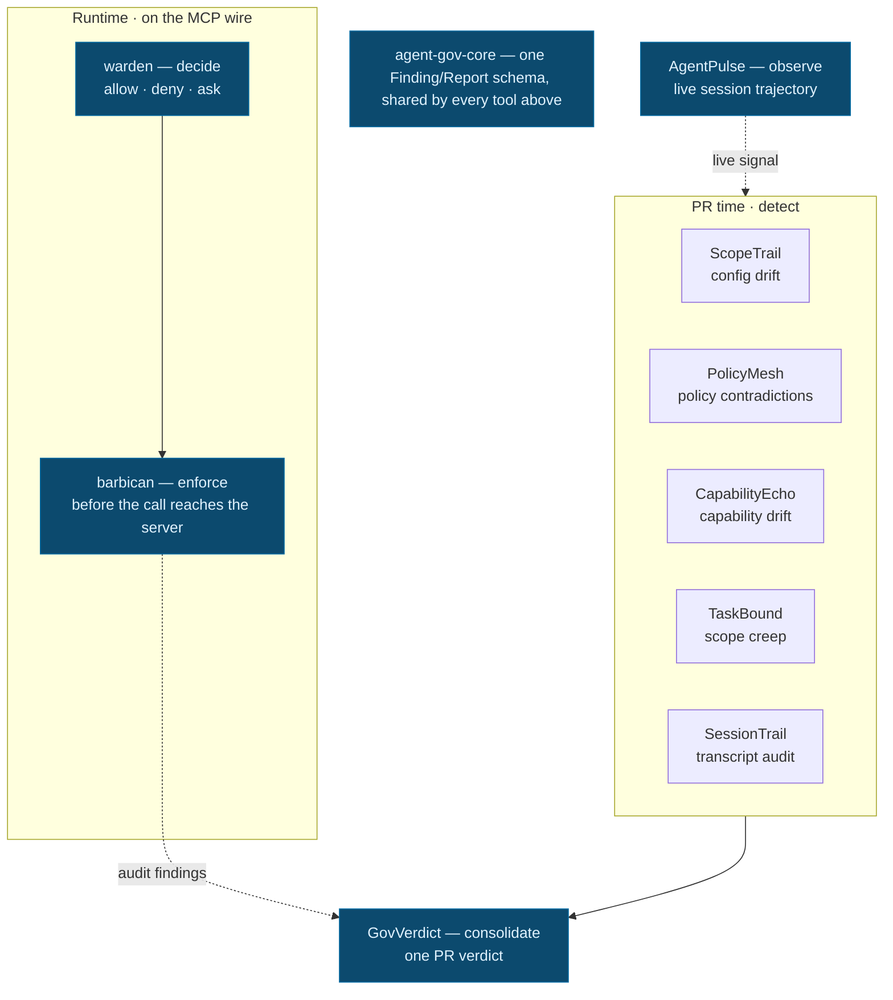

# The agent-gov suite

A local-first, deterministic governance stack for AI-agent development. This document explains
the whole suite end to end: what each tool does, which failure it catches, how to adopt it
incrementally, and where its boundaries are.

## Thesis

**Local-first deterministic governance for AI-agent development.**

As coding agents gain the ability to call tools, edit configs, run shell, and open PRs, the
risky decisions move into automated paths that a human never directly reviews. The agent-gov
suite puts deterministic, inspectable checkpoints on those paths — at runtime, at PR time, and
after a session runs — so agent drift is visible *before* it lands. Every decision is
reproducible, every finding traces back to the exact input that produced it, and there is **no
LLM in the default decision path**. The tools share one `Finding`/`Report` schema, so they
compose into a single review instead of overlapping.

The flow is one line: **decide → enforce** (runtime) **→ detect** (PR time) **→ consolidate →
observe**.

## How it fits together

## The tools

| Tool | Stage | Input | Output | What it does |
|---|---|---|---|---|
| [warden](https://github.com/Conalh/warden) | runtime · decide | policy + tool action | verdict (allow / deny / ask) | Deterministic policy DSL engine (Rust) that decides whether one agent action is allowed, denied, or escalated to a human. |
| [barbican](https://github.com/Conalh/barbican) | runtime · enforce | MCP `tools/list` + `tools/call` | enforced MCP proxy + reports | Transparent stdio proxy that consults warden on every call and makes the verdict bind before it reaches the server; also screens tool descriptions for poisoning. |
| [ScopeTrail](https://github.com/Conalh/ScopeTrail) | PR · detect | PR base/head agent config | annotations + report | Diffs agent config files (`.claude`, `.mcp.json`, Codex sandbox) and reports permission/config drift. |
| [PolicyMesh](https://github.com/Conalh/PolicyMesh) | PR · detect | current repo policy/config files | report / SARIF | Finds rules that contradict each other across MCP, Claude, Cursor, VS Code, Codex, and Aider config surfaces. |
| [CapabilityEcho](https://github.com/Conalh/CapabilityEcho) | PR · detect | PR diff | annotations + report | Flags new executable capability — network, subprocess, eval, lifecycle, workflow permissions — on the exact added lines. |
| [TaskBound](https://github.com/Conalh/TaskBound) | PR · detect | stated task + PR diff | annotations + report | Compares the stated task to the actual diff and flags scope creep. |
| [SessionTrail](https://github.com/Conalh/SessionTrail) | post-run · detect | Cursor/Claude/Codex JSONL transcripts | report / SARIF | Audits a transcript an agent already produced for risky runtime behavior. |
| [GovVerdict](https://github.com/Conalh/GovVerdict) | consolidate | JSON reports from the tools above | one merged report | Dedupes findings by fingerprint and renders a single decision-ready PR verdict. |
| [AgentPulse](https://github.com/Conalh/AgentPulse) | observe | live session events | terminal dashboard | Classifies a running session's trajectory: converging, exploring, stuck, drifting, done, idle. |
| [agent-gov-core](https://github.com/Conalh/agent-gov-core) | substrate | shared schemas/parsers | library | The canonical `Finding`/`Report` model, parsers, locators, and merge helpers every tool above is built on. |
| [agent-gov-demo](https://github.com/Conalh/agent-gov-demo) | proof | a rogue PR | demonstration | Sandbox repo whose one deliberately-mislabeled PR trips every detector at once, so you can see the suite work end to end. |
| [agent-gov-fieldtest](https://github.com/Conalh/agent-gov-fieldtest) | proof | a real third-party agent system | runnable writeup | Anonymized field test applying the suite against a real background-agent coding platform — runtime enforcement, credential brokering, and a pre-PR capability gate. |

> Related: [overreach](https://github.com/Conalh/overreach) is a standalone, language-agnostic
> capability scanner — the same idea as CapabilityEcho repackaged as one fast Rust binary, for
> when you want a quick gate without adopting the suite.

## Failure modes — which tool catches what

| If this happens… | …this catches it |
|---|---|
| An agent calls a risky MCP tool at runtime | [warden](https://github.com/Conalh/warden) decides + [barbican](https://github.com/Conalh/barbican) enforces |
| A PR changes agent configuration | [ScopeTrail](https://github.com/Conalh/ScopeTrail) |
| A repo carries contradictory instructions across agent surfaces | [PolicyMesh](https://github.com/Conalh/PolicyMesh) |
| Code adds `fetch`/`exec`/lifecycle scripts (new capability) | [CapabilityEcho](https://github.com/Conalh/CapabilityEcho) |
| A PR drifts from its stated task | [TaskBound](https://github.com/Conalh/TaskBound) |
| A runtime transcript shows risky behavior | [SessionTrail](https://github.com/Conalh/SessionTrail) |
| Multiple tool reports need one verdict | [GovVerdict](https://github.com/Conalh/GovVerdict) |
| A live session is drifting or stuck | [AgentPulse](https://github.com/Conalh/AgentPulse) |

## Suggested adoption path

Adopt incrementally — each step is useful on its own and nothing requires the step before it.

1. **Start advisory.** Run the tools in report-only mode so findings are visible but never block. Build trust in the signal before gating on it.
2. **Run the static PR-time tools.** Wire [ScopeTrail](https://github.com/Conalh/ScopeTrail), [PolicyMesh](https://github.com/Conalh/PolicyMesh), [CapabilityEcho](https://github.com/Conalh/CapabilityEcho), and [TaskBound](https://github.com/Conalh/TaskBound) into CI on every PR. No runtime changes required.
3. **Add the runtime proxy where MCP calls matter.** For agents that actually call MCP tools, put [barbican](https://github.com/Conalh/barbican) on the wire with a [warden](https://github.com/Conalh/warden) policy so verdicts bind before a call executes.
4. **Add transcript review for high-risk sessions.** Run [SessionTrail](https://github.com/Conalh/SessionTrail) over the JSONL transcripts of sessions you care about, and watch live ones with [AgentPulse](https://github.com/Conalh/AgentPulse).
5. **Merge reports with GovVerdict.** Once several tools are running, collect their reports and let [GovVerdict](https://github.com/Conalh/GovVerdict) dedupe them into one verdict per PR.

New to the suite? See it trip end to end on [agent-gov-demo](https://github.com/Conalh/agent-gov-demo), or read the real-system writeup in [agent-gov-fieldtest](https://github.com/Conalh/agent-gov-fieldtest).

## What this is not

- **Not a sandbox replacement.** It checks and gates decisions; it does not isolate or contain execution. Run it alongside real sandboxing, not instead of it.
- **Not a complete SAST platform.** It targets agent-specific drift — capabilities, config, scope, transcripts — not general application security or full static analysis.
- **Not a guarantee against adversarial code.** Determinism means a clean result says "no implemented rule matched," not "this is safe." A motivated adversary can route around any fixed ruleset.
- **Not an LLM judge in the default decision path.** Decisions are made by deterministic rules. Any LLM assistance is opt-in and never sits in the default allow/deny path.
