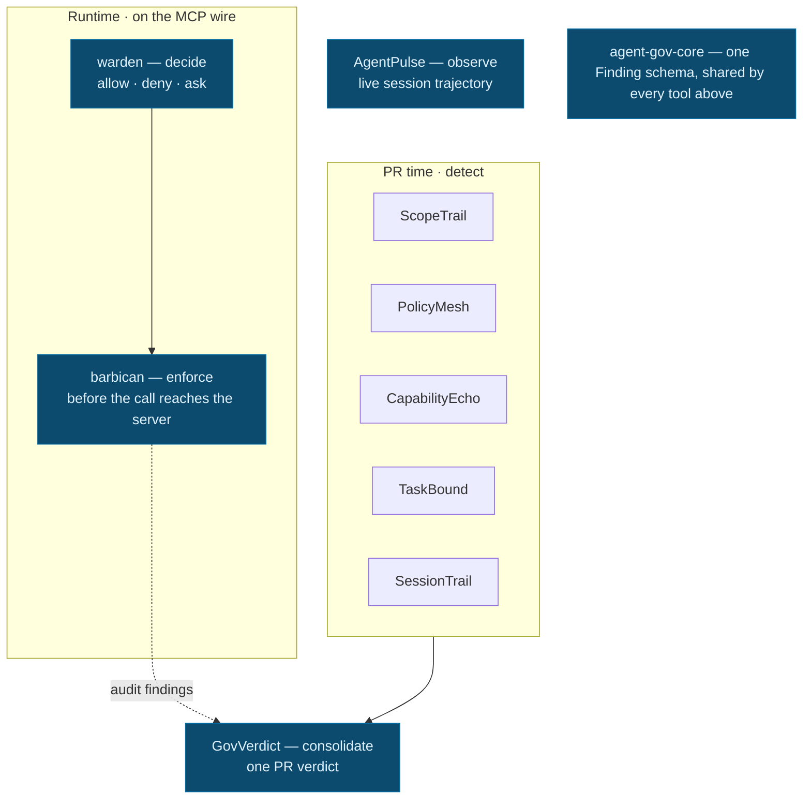

# Conal (Connor) Hickey

### Currently building

**[Skunky](https://github.com/Conalh/Skunky)** - a local-first compartmentalized LLM work system.
Hand _bounded_, _sanitized_ work to untrusted LLM workers - without handing them your secrets.
Encrypted artifacts, single-use handles, tamper-evident audit chains, cumulative disclosure budgets.

 

I build deterministic, local-first tools for governing AI agents: policy engines, MCP runtime enforcement, PR-time drift scanners, transcript review, and evidence-backed reports. I also apply the same design style to repository analysis and conservative health/training decision-support tools.

**What I build**

- **AI-agent governance** — policy decisions, runtime MCP enforcement, PR-time drift detection, transcript audits, and consolidated verdicts.
- **Repository & supply-chain analysis** — codebase orientation, stale-repo autopsies, capability scanning, and dependency provenance.
- **Evidence-backed health/training workflows** — conservative decision support that exposes inputs, rules, and evidence. Not diagnosis, not treatment.

Burbank, CA · TypeScript · Rust · Python · React · Node · FastAPI

GitHub [@Conalh](https://github.com/Conalh) · X [@conalhck](https://x.com/conalhck) · [dev.to/conalh](https://dev.to/conalh) · [conal.hg@gmail.com](mailto:conal.hg@gmail.com)

## Start here

| Project | What it does |
|---|---|
| **[workstream-continuity-design](https://github.com/Conalh/workstream-continuity-design)** | Public research edition and design bible for Workstream Continuity Design: recovering operating state across concurrent human and AI workstreams. |
| **[Skunky](https://github.com/Conalh/Skunky)** | Local-first compartmentalized LLM work: sanitized worker packets, broker-private handles, hostile artifact intake, passphrase-wrapped local keystore, and CI-backed verification. |
| **[warden](https://github.com/Conalh/warden)** | Rust policy DSL engine that decides allow / deny / ask for agent actions. Zero-dependency core. [Live playground](https://conalh.github.io/warden/). |
| **[barbican](https://github.com/Conalh/barbican)** | MCP stdio proxy that binds warden's verdicts before a tool call reaches the server. |
| **[CapabilityEcho](https://github.com/Conalh/CapabilityEcho)** | PR-time scanner for executable capability drift — new network, subprocess, eval, and lifecycle signals on the exact added lines. |
| **[project-autopsy](https://github.com/Conalh/project-autopsy)** | Evidence-backed autopsy reports for stale repos: findings, stall hypotheses, and revival tasks. Full-stack TypeScript. |
| **[ehr-backend](https://github.com/Conalh/ehr-backend)** | Synthetic-only clinical records API in Kotlin / Spring Boot / Postgres — FHIR R4, patient-compartment authorization, a deterministic policy spine, and append-only audit + provenance. |
| **[recovery-trail](https://github.com/Conalh/recovery-trail)** | 100% client-side recovery briefing from an Apple Health export, with ACSM-aligned verdicts and full rule traces. [Live demo](https://conalh.github.io/recovery-trail/). |
| **[fit-ontology](https://github.com/Conalh/fit-ontology)** | Client intelligence layer for personal trainers — wearables, intake, and ACSM guidelines unified into one explainable, rules-based ontology. |

## Agent governance stack

A local-first stack with one job per tool and one shared schema, so the pieces compose instead of overlap: **decide → enforce → detect → consolidate → observe**. There is no LLM in the decision path.

**Full walkthrough:** [AGENT_GOVERNANCE_STACK.md](AGENT_GOVERNANCE_STACK.md) — the whole suite end to end, with a diagram, a failure-mode map, and an adoption path.

| Tool | Role |
|---|---|
| **[warden](https://github.com/Conalh/warden)** | **decide** — allow / deny / ask policy engine (Rust, zero-dependency). |
| **[barbican](https://github.com/Conalh/barbican)** | **enforce** — binds verdicts on the MCP wire before the call lands. |
| **[ScopeTrail](https://github.com/Conalh/ScopeTrail)** | **config diff** — what changed in agent config files. |
| **[PolicyMesh](https://github.com/Conalh/PolicyMesh)** | **current policy contradictions** — across MCP, Claude, Cursor, VS Code, Codex, Aider. |
| **[CapabilityEcho](https://github.com/Conalh/CapabilityEcho)** | **executable capability drift** — new network / subprocess / eval / lifecycle signals on added lines. |
| **[TaskBound](https://github.com/Conalh/TaskBound)** | **task-vs-diff scope creep** — stated task compared to the actual change. |
| **[SessionTrail](https://github.com/Conalh/SessionTrail)** | **runtime transcript audit** — Cursor / Claude Code / Codex sessions for risky behavior. |
| **[GovVerdict](https://github.com/Conalh/GovVerdict)** | **merge/dedupe verdicts** — one consolidated PR result from the detector suite. |
| **[AgentPulse](https://github.com/Conalh/AgentPulse)** | **live trajectory observation** — converging, exploring, stuck, drifting, done, idle. |
| **[agent-gov-core](https://github.com/Conalh/agent-gov-core)** | **shared schema/parsers** — canonical Finding schema and JSONC/TOML/MCP/shell/transcript parsers. |

Architecture diagram

**Field-tested.** Beyond the synthetic [agent-gov-demo](https://github.com/Conalh/agent-gov-demo), I ran the whole stack against a real open-source background-agent coding platform I did not write — runtime MCP enforcement, credential-broker authorization, and a pre-PR capability gate — and fixed a cross-component bug it surfaced. Anonymized writeup: **[agent-gov-fieldtest](https://github.com/Conalh/agent-gov-fieldtest)**.

## Repository-analysis tools

Standalone tools for understanding codebases, reviewing risky changes, finding documentation drift, and verifying dependency provenance.

- **[repo-brief](https://github.com/Conalh/repo-brief)** — orientation layer for unfamiliar repos: architecture map, key files, hotspots, run commands, and where to start.
- **[project-autopsy](https://github.com/Conalh/project-autopsy)** — evidence-backed autopsy reports for stale repositories, over a deterministic, CI-tested core; CLI plus a Next.js report UI.
- **[docs-debt-radar](https://github.com/Conalh/docs-debt-radar)** — scans repositories for stale, missing, and drifting documentation claims.
- **[overreach](https://github.com/Conalh/overreach)** — Rust capability scanner for diffs, files, and repos: network calls, subprocesses, sensitive-file reads, `curl | sh`, disabled TLS, hardcoded secrets.
- **[tofulock](https://github.com/Conalh/tofulock)** — Go. Locks and verifies Terraform/OpenTofu module sources by commit digest.
- **[cpan-integ](https://github.com/Conalh/cpan-integ)** — Perl. Consumer-side, install-time artifact-hash verification for CPAN distributions. Experimental.
- **[timecal](https://github.com/Conalh/timecal)** — cross-agent time-calibration corpus served over MCP, countering the engineer-weeks prior agents inherit. [On PyPI](https://pypi.org/project/timecal/).

## Health/training decision-support

Conservative decision-support tools — **not diagnosis, not treatment recommendation**. Each one exposes its inputs, the rules that fired, confidence limits, and the raw evidence, so a human stays in the loop on every call.

- **[fit-ontology](https://github.com/Conalh/fit-ontology)** — trainer-facing client intelligence: unifies wearables, intake, and ACSM guidelines into a queryable model with explainable rules traceable back to the metric rows that fired them.
- **[recovery-trail](https://github.com/Conalh/recovery-trail)** — athlete-facing recovery briefing from an Apple Health export. Runs 100% client-side; shows HRV, RHR, sleep, load, ACSM-aligned verdicts, and rule traces. [Live demo](https://conalh.github.io/recovery-trail/).
- **[nutrition-experiment-lab](https://github.com/Conalh/nutrition-experiment-lab)** — personal n-of-1 nutrition experiment notebook with adherence tracking, confounder notes, confidence, and transparent next-test suggestions.
- **[injury-return-to-play-tracker](https://github.com/Conalh/injury-return-to-play-tracker)** — clinician- and coach-facing workflow for phase progress, functional-test evidence, workload tolerance, and human clearance decisions.
- **[academic-load-burnout-monitor](https://github.com/Conalh/academic-load-burnout-monitor)** — student workload planner with explainable pressure signals, check-ins, and recovery-aware next actions.

## Working style

- **Deterministic first** — the important decisions are reproducible and inspectable, not model-dependent.
- **Local-only when possible** — tools run on your machine; no data leaves it unless you opt in.
- **Evidence-backed reports** — every verdict traces back to the inputs, rules, and lines that produced it.
- **No LLM in governance decision paths** unless explicitly opt-in.
