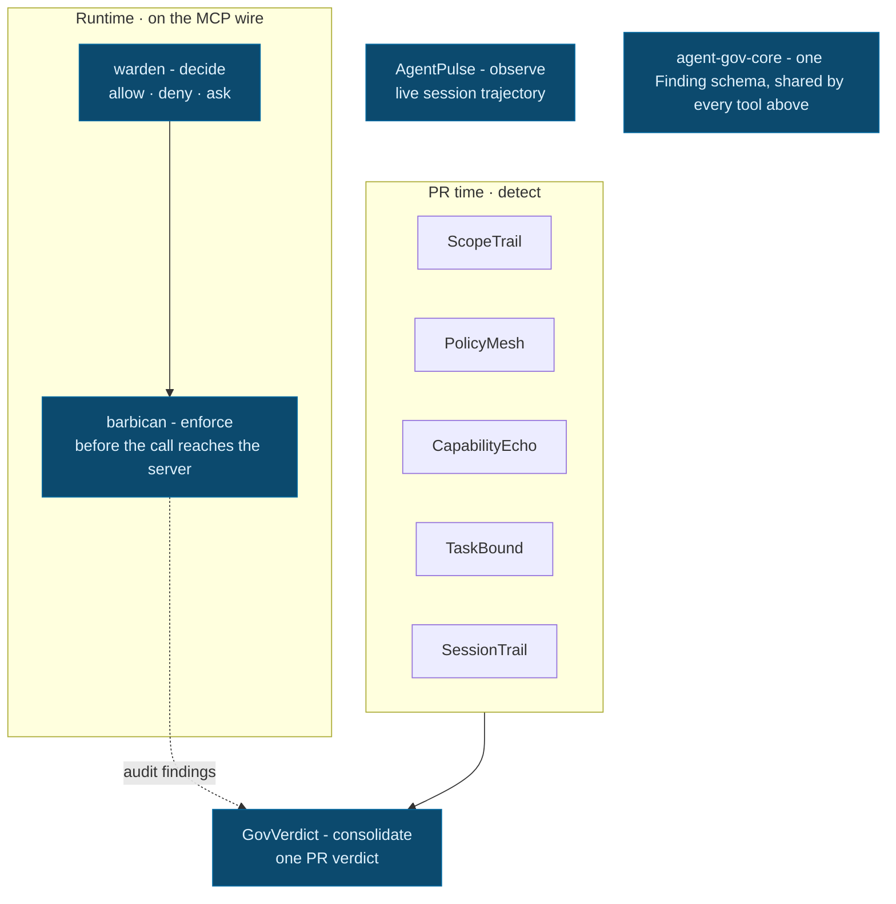

# Conal (Connor) Hickey

I build local-first developer tools for AI-agent governance, repository analysis, and evidence-backed health workflows.

My recurring constraint: keep the important decisions deterministic, auditable, and inspectable. In the agent-governance work, there is no LLM in the decision path.

Open to AI-agent infrastructure/safety, developer-tooling, and full-stack product engineering roles.

TypeScript · Rust · Python · React · Node · FastAPI  
Pasadena, CA · GitHub [@conalh](https://github.com/Conalh) · X [@conalhck](https://x.com/conalhck) · [dev.to/conalh](https://dev.to/conalh) · [conal.hg@gmail.com](mailto:conal.hg@gmail.com)

## Start here

| Project | Why it matters |
|---|---|
| **[warden](https://github.com/Conalh/warden)** | Rust policy DSL engine for agent actions: allow, deny, ask. Hand-written lexer, Pratt parser, evaluator, static unreachable-rule analysis, zero-dependency core. [Live playground](https://conalh.github.io/warden/). |
| **[barbican](https://github.com/Conalh/barbican)** | MCP stdio proxy that makes warden's verdicts bind before tool calls reach the server. |
| **[CapabilityEcho](https://github.com/Conalh/CapabilityEcho)** | PR-time capability drift scanner: flags new network calls, subprocesses, eval, lifecycle scripts, and workflow-permission changes on exact added lines. |
| **[AgentPulse](https://github.com/Conalh/AgentPulse)** | Local terminal dashboard for live agent-session trajectory: converging, exploring, stuck, drifting, done, idle. |
| **[overreach](https://github.com/Conalh/overreach)** | Rust scanner for risky code capabilities across diffs, files, and repos. |
| **[fit-ontology](https://github.com/Conalh/fit-ontology) / [recovery-trail](https://github.com/Conalh/recovery-trail)** | Explainable health decision-support tools with visible inputs, rule traces, and conservative recommendations. [recovery-trail live demo](https://conalh.github.io/recovery-trail/) |

## Agent governance stack

A local-first agent-governance stack: policy decisions, runtime enforcement, PR-time drift detection, consolidated review, and session observability. The goal is to make agent drift visible before it lands, while keeping reports auditable and easy to wire into CI. Every tool speaks one shared Finding schema, so the pieces compose instead of overlap: decide → enforce → detect → consolidate → observe.

Architecture diagram

**Substrate**

- **[agent-gov-core](https://github.com/Conalh/agent-gov-core)** - canonical Finding schema, mergeFindings, JSONC/TOML/MCP/shell/transcript parsers, and shared report primitives. Zero runtime dependencies.

**Decide & enforce (runtime)**

- **[warden](https://github.com/Conalh/warden)** - a policy DSL engine in Rust that decides whether an agent action is allow, deny, or ask, and streams those verdicts as JSON over stdio for an agent's tool-use loop. Same family as AWS Cedar / OPA-Rego, with a recursive-descent + Pratt parser, glob matcher, static unreachable-rule detection, and rustc-style diagnostics - no parser generator, zero dependencies. [Live playground](https://conalh.github.io/warden/).
- **[barbican](https://github.com/Conalh/barbican)** - the runtime that makes warden's verdicts bind: a transparent stdio MCP proxy that consults warden on every tools/call and enforces the verdict before the call reaches the server. Also screens advertised tool descriptions for poisoning at tools/list, and rolls every decision into canonical agent-gov-core reports.

**Detect (PR time)**

- **[ScopeTrail](https://github.com/Conalh/ScopeTrail)** - diffs agent config files such as .claude/settings.json, .mcp.json, and Codex sandbox settings, and tells you what just changed.
- **[PolicyMesh](https://github.com/Conalh/PolicyMesh)** - finds contradictions across MCP, Claude, Cursor, VS Code, Codex, and Aider configs.
- **[CapabilityEcho](https://github.com/Conalh/CapabilityEcho)** - flags new network calls, subprocesses, eval, lifecycle scripts, and workflow-permission signals on the exact added diff lines. Currently reports 100% recall and 0 false positives on a labeled 34-PR [benchmark corpus](https://github.com/Conalh/CapabilityEcho/tree/main/benchmark).
- **[TaskBound](https://github.com/Conalh/TaskBound)** - compares the stated task to the actual PR diff and flags likely scope creep.
- **[SessionTrail](https://github.com/Conalh/SessionTrail)** - audits Cursor, Claude Code, and Codex transcripts for risky runtime behavior.

**Consolidate & observe**

- **[GovVerdict](https://github.com/Conalh/GovVerdict)** - ingests reports from the detector suite, dedupes by fingerprint, and renders one consolidated PR verdict.
- **[AgentPulse](https://github.com/Conalh/AgentPulse)** - classifies live agent sessions as converging, exploring, stuck, done, drifting, or idle.
- **[agent-gov-demo](https://github.com/Conalh/agent-gov-demo)** - the sandbox proof repo. Its rogue PR is deliberately titled "fix: typo in README" while tripping every detector at once.

**Field-tested on a real system.** Beyond the synthetic agent-gov-demo, I applied the whole stack to a real open-source background-agent coding platform I did not write: threat-modeled its authorization model, then ran runtime MCP policy enforcement, credential-broker authorization, and a pre-PR capability gate against it. The integration also surfaced, and I fixed, a cross-component bug in the suite itself. Runnable, anonymized writeup: **[agent-gov-fieldtest](https://github.com/Conalh/agent-gov-fieldtest)**.

## Agent infrastructure

- **[TimeCal](https://github.com/Conalh/timecal)** - a cross-agent time-calibration corpus served over MCP. It serves real "human-estimated, actually-took" rows before an agent scopes a task, countering the engineer-weeks prior agents inherit from human software timelines. [On PyPI](https://pypi.org/project/timecal/) - uvx timecal.

## Repository and supply-chain tools

Standalone tools for understanding codebases, reviewing risky changes, finding documentation drift, and verifying dependency provenance.

- **[RepoBrief](https://github.com/Conalh/repo-brief)** - orientation layer for unfamiliar repos: architecture map, key files, risk summary, hotspots, run commands, and where to start.
- **[Project Autopsy](https://github.com/Conalh/project-autopsy)** - evidence-backed autopsy reports for stale repositories: score, verdict, findings, stall hypotheses, revival tasks, and source evidence. Full-stack TypeScript monorepo - a CLI plus a Next.js report UI and API over one deterministic, CI-tested analysis core; ingests local paths and public or private GitHub repos.
- **[Docs Debt Radar](https://github.com/Conalh/docs-debt-radar)** - scans repositories for stale, missing, and drifting documentation claims.
- **[overreach](https://github.com/Conalh/overreach)** - Rust capability scanner for diffs, files, and repos; catches network calls, subprocesses, sensitive-file reads, curl | sh, disabled TLS, and hardcoded secrets.
- **[tofulock](https://github.com/Conalh/tofulock)** - Go. Locks and verifies Terraform/OpenTofu module sources by commit digest - the integrity providers get from the native lockfile, but modules don't.
- **[cpan-integ](https://github.com/Conalh/cpan-integ)** - Perl. Consumer-side, install-time artifact-hash verification for CPAN distributions. Experimental.

## Evidence-backed health workflows

These projects are conservative decision-support tools. They expose inputs, rules, confidence limits, and raw evidence instead of making medical diagnoses or automatic clearance decisions.

- **[fit-ontology](https://github.com/Conalh/fit-ontology)** - trainer-facing client intelligence. It unifies wearables, intake, and ACSM guidelines into a queryable model with explainable rules. Engine v2 produces weekly training recommendations traceable back to the exact metric rows that fired each rule.
- **[recovery-trail](https://github.com/Conalh/recovery-trail)** - athlete-facing recovery briefing from an Apple Health export. It runs 100% client-side and shows HRV, RHR, sleep, load, ACSM-aligned verdicts, and rule traces. [Live demo](https://conalh.github.io/recovery-trail/)
- **[Nutrition Experiment Lab](https://github.com/Conalh/nutrition-experiment-lab)** - personal n-of-1 nutrition experiment notebook with adherence tracking, confounder notes, confidence, and transparent next-test suggestions.
- **[Injury Return-To-Play Tracker](https://github.com/Conalh/injury-return-to-play-tracker)** - clinician- and coach-friendly workflow for phase progress, symptoms, functional test evidence, workload tolerance, reporting, and human clearance decisions.
- **[Academic Load + Burnout Monitor](https://github.com/Conalh/academic-load-burnout-monitor)** - student workload planner with explainable pressure signals, check-ins, study sessions, planning blocks, and recovery-aware next actions.

## Other systems work

- **[breachline](https://github.com/Conalh/breachline)** - a server-authority-first browser tactical FPS in a TypeScript monorepo: an authoritative tick loop, a binary wire protocol, and client prediction/interpolation. An architecture-first engine spine (not a playable build yet) - here for the systems and netcode work, not the game.
